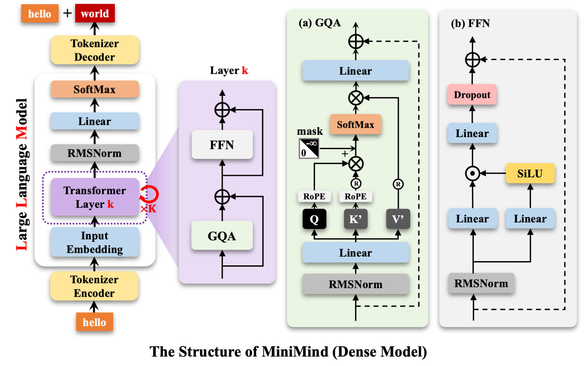
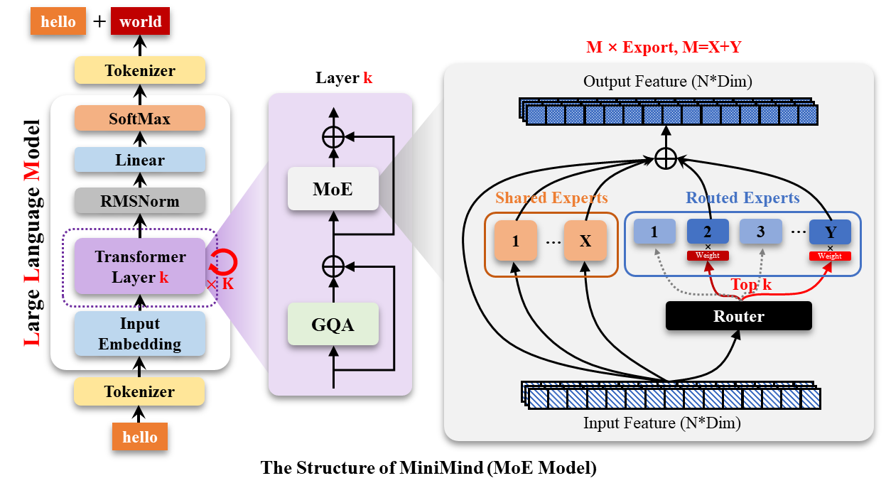

# LLM & VLM Learning

## 模型架构




## AutoDL
1. 开启学术加速：`source /etc/network_turbo`
2. 取消学术加速：`unset http_proxy && unset https_proxy`

## Github
提交代码：
```bash
git add .
git commit -m "first commit"
git branch -M main
git remote add origin https://github.com/jryxxx/LLM.git
git push -u origin main
```